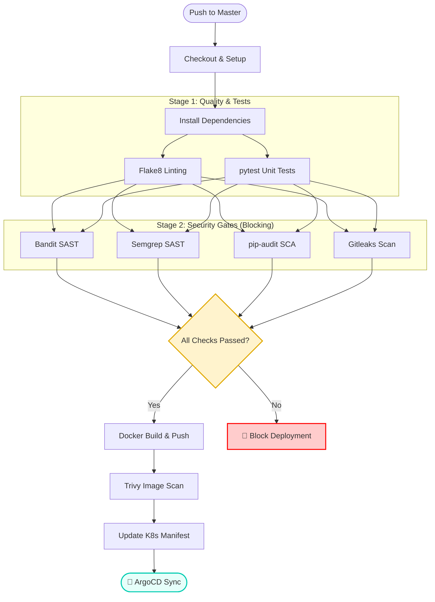

# GitHub Actions Workflows

This directory contains GitHub Actions workflows for the ITSM Ticket Management project.

## Workflows

### app-pipeline.yml

**Name:** DevSecOps CI/CD Pipeline

**Purpose:** This production-grade pipeline automates the "Code-to-Cluster" journey. It enforces strict security gates (SAST, SCA, Secret Scanning), runs unit tests, builds Docker images, and updates Kubernetes manifests via GitOps.

#### Triggers
- **Push** to `master` branch (only for changes in `src/`)
- **Pull Request** to `master` branch (only for changes in `src/`)

#### Pipeline Visualization

#### Permissions
- `contents: write` - Required for pushing version updates back to the repository

#### Jobs

##### ci-cd-pipeline
Runs on `ubuntu-latest` and includes the following steps:

| Step | 🔧 Action | 📝 Description |
|------|-----------|----------------|
| 1 | **📥 Checkout Code** | Clones the repository with full history using `actions/checkout@v4` |
| 2 | **🐍 Set up Python 3.10** | Installs Python 3.10 with pip caching for faster builds |
| 3 | **📦 Install Dependencies** | Installs application and development dependencies from `requirements.txt` and `requirements-dev.txt` |
| 4 | **🔍 Run Flake8 Linting** | Lints Python code in `src/` directory with rules: • Max complexity: 11 • Max line length: 127 • Shows statistics (non-blocking) |
| 5 | **🧪 Run Tests** | Executes pytest test suite in `src/test/` directory |
| 6 | **🔒 Bandit Security Scan** | Scans for Python security issues (Medium/High severity only) |
| 7 | **📋 pip-audit Scan** | Checks Python dependencies for known vulnerabilities |
| 8 | **🔬 Semgrep SAST** | Performs static application security testing for vulnerabilities |
| 9 | **🔑 Gitleaks Scan** | Detects secrets and sensitive data leaks in the codebase |
| 10 | **🏷️ Calculate Version** | Generates version tag: `v{base}.{run_number}` from manifest + GitHub run number |
| 11 | **🏗️ Build Docker Image** | Builds Docker image with calculated version tag |
| 12 | **🛡️ Trivy Vulnerability Scan** | Scans Docker image for OS and library vulnerabilities (Critical/High only) |
| 13 | **🔐 Docker Hub Login** | Authenticates with Docker Hub using repository secrets |
| 14 | **📤 Push Docker Images** | Pushes versioned and `latest` tags to Docker Hub |
| 15 | **📝 Update K8s Manifest** | Updates deployment YAML with new image version and commits changes |

#### Requirements

**Secrets:**
- `DOCKER_USERNAME` - Docker Hub username
- `DOCKER_PASSWORD` - Docker Hub access token (not password)
- `GITHUB_TOKEN` - Automatically provided by GitHub

##### Setting up Docker Hub Secrets

1. **Create Docker Hub Access Token:**
   - Log in to [Docker Hub](https://hub.docker.com/)
   - Go to **Account Settings** > **Security**
   - Click **New Access Token**
   - Give it a descriptive name (e.g., "GitHub Actions CI/CD")
   - Copy the generated token immediately (you won't see it again)

2. **Add Secrets to GitHub Repository:**
   - Go to your GitHub repository
   - Navigate to **Settings** > **Secrets and variables** > **Actions**
   - Click **New repository secret**
   - Create two secrets:
     - Name: `DOCKER_USERNAME`
       - Value: Your Docker Hub username
     - Name: `DOCKER_PASSWORD`
       - Value: The access token you generated (paste the entire token)
   - Click **Add secret** for each

**Note:** Use an access token instead of your Docker Hub password for better security. Access tokens can be revoked individually without changing your account password.

**Files:**
- `src/requirements.txt` - Application dependencies
- `src/requirements-dev.txt` - Development dependencies (Flake8, pytest, bandit, semgrep)
- `src/reports/.trivyignore` - Trivy vulnerability ignore rules
- `k8s/application_deployment/app/active-deployment.yaml` - Kubernetes deployment manifest

#### Outputs

- **Docker Image:** `jaiswaranil8387/anil_doc_repo:{version}` and `latest` tags pushed to Docker Hub
- **Kubernetes Manifest Update:** Automatic update of image version in `k8s/application_deployment/app/active-deployment.yaml`

#### Versioning

The pipeline uses semantic versioning based on:
- Base version extracted from the current Kubernetes manifest
- GitHub Actions run number as the patch version
- Format: `v{base}.{run_number}` (e.g., `v7.45`)

#### Security Features (Enforcing Mode)
This pipeline implements a **"Shift Left"** security strategy. Unlike standard pipelines, this workflow acts as a Quality Gate and **will fail the build** if critical vulnerabilities are detected.

| Tool | Type | Behavior |
|------|------|----------|
| **Flake8** | Linting | ⚠️ Non-Blocking (Reports style issues only) |
| **Bandit** | SAST | 🛑 **Blocking** (Fails on Medium/High risks) |
| **Semgrep** | SAST | 🛑 **Blocking** (Fails on security findings) |
| **Gitleaks** | Secret Scan | 🛑 **Blocking** (Fails if secrets are found) |
| **Trivy** | Container Scan | 🛑 **Blocking** (Fails on Critical/High CVEs) |

#### Notes
- **Caching:** Uses `pip` caching to speed up dependency installation.
- **GitOps:** The final step updates the `active-deployment.yaml` file, which triggers ArgoCD to deploy the new version automatically.
- **Loop Prevention:** The automated commit includes `[skip ci]` to prevent the pipeline from triggering itself recursively.
