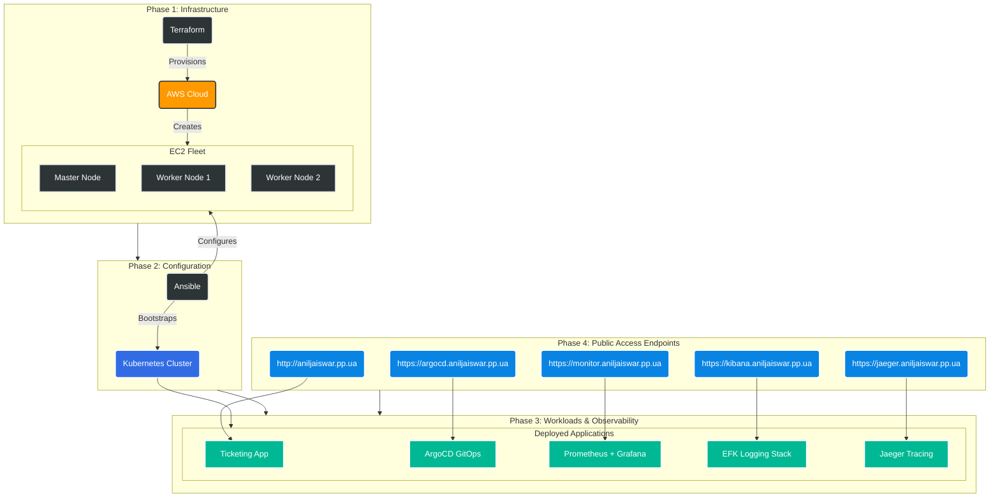

# 🎫 ITSM Ticket Management System with Full DevOps Automation

                   

> 🚀 **Production-Grade DevOps Demo**: From Code to Cluster with Security, Monitoring & GitOps!

## 📋 Quick Navigation

- [🎯 What is This?](#-what-is-this)
- [📂 Explore the Project](#-explore-the-project)
- [🏗️ System Architecture](#️-system-architecture)
- [🚀 Quick Start](#-quick-start)
- [🔗 Live Demo URLs](#-live-demo-urls)
- [🧹 Cleanup](#-cleanup)
- [🆘 Help](#-help)

## 🎯 What is This?

A complete **ITSM Ticket Management System** that demonstrates modern DevOps practices:

- 🎫 **Smart Ticketing App** (Flask + PostgreSQL)
- ☁️ **Auto AWS Infrastructure** (Terraform + Ansible)
- 🔄 **GitOps Deployments** (ArgoCD)
- 📊 **Full Observability** (Prometheus + Grafana + EFK + Jaeger)
- 🔒 **Security-First CI/CD** (GitHub Actions with SAST/SCA scans)
- 🐳 **No "Works on My Machine" Issues** (Dockerized environments)

## 📂 Project Structure & Navigation

New users should explore the folders in this order to understand the full workflow:

### 1. `src/` (The Application)
> **Start here if:** You want to run the Python application locally or understand the code logic.
- Contains the source code for the Flask ITSM application.
- Includes `Dockerfile` for building the app image.
- [📄 Read the src/ README](src/README.md)

### 2. `ubuntu/` (The Environment)
> **Start here if:** You are setting up your machine to deploy infrastructure.
- Creates a standardized Docker container ("DevOps Box") with all necessary tools pre-installed (Terraform, Ansible, AWS CLI, Kubectl).
- Ensures you don't face "it works on my machine" issues regardless of your OS (Windows/Mac/Linux).
- [📄 Read the ubuntu/ README](ubuntu/README.md)

### 3. `k8s/` (The Infrastructure & Deployment)
> **Start here if:** You are ready to provision AWS servers and deploy the cluster.
- **Terraform:** Provisions EC2 instances (Master & Workers) on AWS.
- **Ansible:** Configures the Kubernetes cluster and joins nodes.
- **Scripts:** `deploy_all.sh` automates the entire provisioning process.
- **Manifests:** Contains Kubernetes YAML files for the App, Database, Ingress, and Monitoring stack.
- [📄 Read the k8s/ README](k8s/README.md)

### 4. `.github/` (The CI/CD Automation)
> **Start here if:** You want to see how code changes are automatically tested, scanned, and released.
- Contains the GitHub Actions workflow (`app-pipeline.yml`).
- Automates Unit Testing, SAST Security Scans, Docker Builds, and GitOps updates.
- [📄 Read the .github/ README](.github/workflows/README.md)

## 🏗️ Architecture

The system follows a phased deployment approach:



- **Infrastructure**: AWS EC2 instances provisioned via Terraform.
- **Configuration**: Ansible playbooks for Kubernetes cluster setup and node joining.
- **Application**: ITSM Ticket Management app deployed via Kubernetes manifests with Nginx Ingress.
- **Observability**: Full stack monitoring, logging, and tracing.

## 🚀 Getting Started

### Quick Local Development (Application Only)

For local development of the ITSM application:

1. **Clone the Repository**:
   ```bash
   git clone https://github.com/jaiswaranil8387/itsm-ticket-management.git
   cd src
   ```

2. **Install Dependencies**:
   ```bash
   pip install -r requirements.txt
   ```

3. **Run the Application**:
   ```bash
   python app.py
   ```

4. **Access**: Open http://localhost:5000 in your browser.

For detailed local setup instructions, see [src/README.md](src/README.md).

### Full DevOps Deployment (Infrastructure + Application)

For complete infrastructure deployment with Kubernetes and observability:

#### Option 1: Dockerized Ubuntu Environment (Recommended)

1. **Configure Host Machine** (Windows/Mac/Linux):
   - Install Docker and Docker Compose.
   - Configure AWS CLI, GitHub SSH, EC2 Key Pair, and create `.env` file (see [ubuntu/README.md](ubuntu/README.md)).

2. **Clone the Repository**:
   ```bash
   git clone https://github.com/jaiswaranil8387/itsm-ticket-management.git
   ```
3. **Launch Environment**:
   ```bash
   cd ubuntu
   docker-compose -f docker-compose-ubuntu.yml up -d --build
   ```
4. **Deploy Pipeline**:
   ```bash
   docker exec -it k8s-deployer bash
   cd ~/k8s
   ./deploy_all.sh
   ```

#### Option 2: Direct AWS EC2 Execution

Perform all setup steps directly on an AWS EC2 instance (see [k8s/README.md](k8s/README.md) for prerequisites), then run:

1. **Clone the Repository**:
   ```bash
   git clone https://github.com/jaiswaranil8387/itsm-ticket-management.git
   cd src
   ```
2. **Deploy Pipeline**:
   ```bash
   cd k8s
   ./deploy_all.sh
   ```

## 🔗 Access Points & Domain URLs

After deployment, access the system via these endpoints:

| Service | Protocol | Access URL (Domain) | Credentials (Default) |
| --- | --- | --- | --- |
| **Ticketing App** | HTTP | [aniljaiswar.pp.ua](https://aniljaiswar.pp.ua/) | admin / admin123 |
| **Kibana** | HTTPS | [kibana.aniljaiswar.pp.ua](https://kibana.aniljaiswar.pp.ua/) | N/A |
| **Grafana** | HTTPS | [monitor.aniljaiswar.pp.ua](https://monitor.aniljaiswar.pp.ua/) | `admin` / `admin` |
| **ArgoCD** | HTTPS | [argocd.aniljaiswar.pp.ua](https://argocd.aniljaiswar.pp.ua/) | `admin` / *(See k8s README)* |
| **Jaeger UI** | HTTPS | [jaeger.aniljaiswar.pp.ua](https://jaeger.aniljaiswar.pp.ua/) | N/A |

> **DNS Note**: Ensure your DNS provider points these subdomains to the Kubernetes worker node's public IP.

## 📊 Verification

After deployment:

1. **Check Cluster Health**:
   ```bash
   kubectl get nodes
   kubectl get pods -A
   ```

2. **Verify Ingress**:
   ```bash
   kubectl get ingress -A
   ```

3. **Test Application**: Access the ticketing app and log in with default credentials.

4. **Check Observability**: Visit Grafana, Kibana, and Jaeger URLs to verify monitoring, logging, and tracing.

## 🧹 Cleanup

To destroy all resources:

1. **Delete Kubernetes Resources**:
   ```bash
   kubectl delete -f k8s/observability/
   kubectl delete -f k8s/application_deployment/
   ```

2. **Destroy Infrastructure**:
   ```bash
   cd k8s/terraform-k8s-project
   terraform destroy -auto-approve
   ```

3. **Stop Docker Containers** (if using Option 1):
   ```bash
   cd ubuntu
   docker-compose -f docker-compose-ubuntu.yml down
   ```

## 🆘 Troubleshooting

Common issues and fixes:

| Issue | Solution |
| --- | --- |
| **Permission Denied (Terraform)** | Run `sudo chown -R ubuntu:ubuntu ~/k8s` in container |
| **SSH Connection Refused** | Ensure `flask-key.pem` is in `~/.ssh` with `chmod 600` |
| **AWS Configuration Errors** | Verify `aws configure` was run on host/container |
| **Kibana Index Setup Failed** | Check Kibana pod status; script retries automatically |
| **Docker Multiplexing Errors** | Disabled in Ansible config for container compatibility |

For detailed troubleshooting, refer to component-specific READMEs.

## 🤝 Contributing

Contributions are welcome! Please:

1. Fork the repository.
2. Create a feature branch (`git checkout -b feature/your-feature`).
3. Make changes and commit (`git commit -m "Add your feature"`).
4. Push to your branch (`git push origin feature/your-feature`).
5. Open a pull request.

Report bugs or suggest features via [GitHub Issues](https://github.com/jaiswaranil8387/itsm-ticket-management/issues).

## 📄 License

This project is licensed under the MIT License.

---

**Author**: Anil Jaiswar  
**Repository**: [itsm-ticket-management](https://github.com/jaiswaranil8387/itsm-ticket-management)
