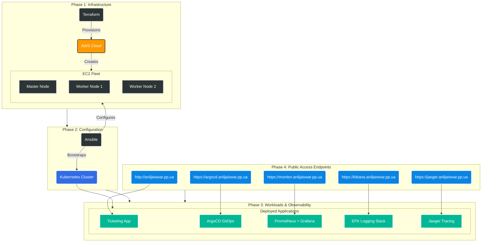

# 🚀 Automated Kubernetes DevOps Pipeline on AWS with ArgoCD

       

## 📋 Table of Contents

- [📖 Project Overview](#-project-overview)
- [🏗️ Architecture](#️-architecture)
- [📂 Repository Structure](#-repository-structure)
- [✅ Prerequisites & Setup Guide](#-prerequisites--setup-guide)
- [🚀 Getting Started](#-getting-started)
- [🔗 Access Points & Domain URLs](#-access-points--domain-urls)
- [🛠️ Key Technical Implementations & Fixes](#️-key-technical-implementations--fixes)
- [📊 Verification](#-verification)
- [🧹 Cleanup](#-cleanup)
- [🆘 Troubleshooting](#-troubleshooting)

## 📖 Project Overview

This repository contains a complete, end-to-end DevOps automation pipeline. It provisions a highly available **Kubernetes Cluster on AWS** using **Terraform**, configures the cluster and worker nodes using **Ansible**, deploys a microservices application (Ticketing System), and sets up a comprehensive **Observability & CD Stack**.

To ensure consistency and eliminate "it works on my machine" issues, this project offers two deployment options: a Dockerized Ubuntu environment or direct execution on an AWS EC2 instance.

---

## 🚀 Deployment Options

Users have two options to implement or run the `deploy_all.sh` script:

### Option 1: Using Ubuntu Image (Recommended for Consistency)

This option uses a Docker-based setup for running the Kubernetes deployment pipeline in a consistent Ubuntu environment, eliminating "it works on my machine" issues. The setup uses a custom Ubuntu Docker image pre-installed with all necessary DevOps tools (AWS CLI, Kubectl, Terraform, Ansible, etc.), allowing deployments to run in a standardized container regardless of the host OS.

For detailed setup instructions, refer to the [ubuntu README](../ubuntu/README.md), which includes:
- Windows Host Setup (One-Time Configuration): Configure AWS CLI, GitHub SSH Access, EC2 Key Pair, and .env file.
- Quick Start: Launch the deployment environment, enter the container, clone the repository, and run the deployment.

### Option 2: Using AWS EC2 Instance

This option involves performing all setup steps manually on an AWS EC2 instance before running the `deploy_all.sh` script. This is suitable for users who prefer direct execution without Docker.

#### Prerequisites for AWS EC2 Instance Setup

Before running `deploy_all.sh`, perform the following steps on your AWS EC2 instance:

##### 1. Configure AWS CLI

If you haven't configured AWS on your EC2 instance yet, follow these steps:

1. Open the terminal on your EC2 instance.
2. Run the configuration command:
   ```bash
   aws configure
   ```
3. Enter your details when prompted:
   - **AWS Access Key ID:** `[Your Access Key]`
   - **AWS Secret Access Key:** `[Your Secret Key]`
   - **Default region name:** `ap-south-1` (or your preferred region)
   - **Default output format:** `json`

##### 2. Configure GitHub SSH Access

To allow the instance to pull code and push changes automatically without passwords:

1. **Generate a new SSH key** (if you don't have one):
   ```bash
   ssh-keygen -t rsa -b 4096 -C "your_email@example.com"
   ```
   *Press Enter to accept the default file location (`~/.ssh/id_rsa`).*

2. **Add the key to GitHub:**
   - Copy the public key content:
     ```bash
     cat ~/.ssh/id_rsa.pub
     ```
   - Go to **GitHub Settings** > **SSH and GPG keys** > **New SSH key**.
   - Paste the key and save.

##### 3. Setup EC2 Key Pair (`flask-key.pem`)

This key is required for Ansible to connect to your EC2 instances.

1. Login to the **AWS Console** > **EC2** > **Key Pairs**.
2. Click **Create key pair**.
3. **Name:** `flask-key`
4. **Key pair type:** `RSA`
5. **Private key file format:** `.pem`
6. Click **Create key pair** to download the file.
7. **IMPORTANT:** Move the downloaded `flask-key.pem` file to your EC2 instance's SSH directory:
   - **Move to:** `~/.ssh/flask-key.pem`
   - Set permissions: `chmod 600 ~/.ssh/flask-key.pem`

##### 4. Create S3 Bucket for Terraform State

Terraform is configured to store its state file in an S3 bucket for remote state management. Create an S3 bucket with the following specifications:

1. **Bucket Name:** `terraform-for-kubernetes`
2. **Region:** `ap-south-1` (or your preferred region)
3. **Bucket Versioning:** Enable versioning
4. **Server-side Encryption:** Enable AES256 encryption

You can create the bucket using the AWS CLI:
```bash
aws s3 mb s3://terraform-for-kubernetes --region ap-south-1
aws s3api put-bucket-versioning --bucket terraform-for-kubernetes --versioning-configuration Status=Enabled
aws s3api put-bucket-encryption --bucket terraform-for-kubernetes --server-side-encryption-configuration '{"Rules": [{"ApplyServerSideEncryptionByDefault": {"SSEAlgorithm": "AES256"}}]}'
```

##### 5. Create `.env` File

Create a file named `.env` in the `k8s` directory with the following variables:

- **TUNNEL_TOKEN**: Required for Cloudflare tunnel setup.
- **FLASK_SECRET_KEY**: Secret key for the Flask application.

Example `.env` file:
```
TUNNEL_TOKEN=your_cloudflare_tunnel_token_here
FLASK_SECRET_KEY=your_flask_secret_key_here
```

Once these steps are completed on your EC2 instance, you can proceed to run `./deploy_all.sh`.

---

## 🏗️ Architecture

The pipeline automates the following architecture:




* **Infrastructure:** AWS EC2 Instances (Master & Worker Nodes) via Terraform.
* **Configuration:** Ansible Playbooks for Kubeadm setup, CNI (Calico/Flannel), and joining nodes.
* **Application:** Python/Flask Ticketing App deployed via Kubernetes Manifests (Nginx Ingress).
* **Continuous Delivery:** **ArgoCD** for GitOps-based deployment.
* **Observability Stack:**
    * **Monitoring:** Prometheus + Grafana.
    * **Logging:** EFK Stack (Elasticsearch, **Fluentbit**, Kibana).
    * **Tracing:** Elasticsearch + Jaeger.

---

## 📂 Repository Structure

```text
├── Dockerfile_Ubuntu        # Custom Control Node image (Terraform, Ansible, K8s tools installed)
├── docker-compose-ubuntu.yml# Configuration to mount local code into the container
├── deploy_all.sh            # Master orchestration script
├── terraform-k8s-project/   # Terraform scripts for AWS Infrastructure
├── cluster_setup/           # Ansible playbooks for K8s Cluster bootstrapping
├── application_deployment/  # Deployment manifests for the Ticketing App
└── observability/           # Prometheus, Grafana, EFK, Jaeger & ArgoCD setups

```

---

## ✅ Prerequisites & Setup Guide

Before running the pipeline, follow the setup steps based on your chosen deployment option.

### For Option 1: Using Ubuntu Image

Refer to the [ubuntu README](../ubuntu/README.md) for detailed prerequisites, including:
- Installing Docker and Docker Compose on your host machine.
- Configuring AWS CLI, GitHub SSH Access, EC2 Key Pair, and creating the `.env` file on your host (Windows/Mac/Linux).

### For Option 2: Using AWS EC2 Instance

Perform the following steps directly on your AWS EC2 instance:

#### 1. Install Required Tools (if not pre-installed)

Ensure the following tools are installed on your EC2 instance:
- AWS CLI
- Terraform
- Ansible
- Kubectl
- Git
- SSH client

Install them using your package manager (e.g., `apt` for Ubuntu, `yum` for Amazon Linux).

#### 2. AWS Configuration (`aws configure`)

You need to connect your environment to your AWS account.

1. Open your terminal on the EC2 instance.
2. Run the configuration command:
```bash
aws configure
```

3. Enter your details when prompted:
* **AWS Access Key ID:** `Paste Your Key ID`
* **AWS Secret Access Key:** `Paste Your Secret Key`
* **Default region name:** `us-east-1` (or your preferred region like `ap-south-1`)
* **Default output format:** `json`

#### 3. Environment Variables

Create a `.env` file in the `k8s` directory with the following variables:

- **TUNNEL_TOKEN**: Required for Cloudflare tunnel setup.
- **FLASK_SECRET_KEY**: Secret key for the Flask application.

Example `.env` file:
```
TUNNEL_TOKEN=your_cloudflare_tunnel_token_here
FLASK_SECRET_KEY=your_flask_secret_key_here
```

#### 4. SSH Key Pair Setup (GitHub & EC2)

##### **Part A: Create GitHub Access Key (To clone/push code)**

If you haven't set up SSH for GitHub yet:

1. Generate a key pair: `ssh-keygen -t ed25519 -C "your_email@example.com"`
2. Start the agent: `eval "$(ssh-agent -s)"` and add the key: `ssh-add ~/.ssh/id_ed25519`
3. Copy the public key: `cat ~/.ssh/id_ed25519.pub`
4. Go to **GitHub Settings** -> **SSH and GPG Keys** -> **New SSH Key**.
5. Paste the key and save.

##### **Part B: Create EC2 Access Key (For Ansible)**

This key is required for Ansible to log in to your AWS servers.

1. Log in to the **AWS Console** -> **EC2** -> **Key Pairs**.
2. Click **Create key pair**.
3. Name it: `flask-key`
4. Select Format: `.pem` (for OpenSSH).
5. Download the file and **move it** to the `.ssh` folder in this project:
```bash
chmod 600 ~/.ssh/flask-key.pem
```


---

## 🚀 Getting Started

### Option 1: Using Ubuntu Image

#### Phase 1: Build the Control Node

We do not install tools locally. We build a standardized Ubuntu container that has all specific versions of Terraform and Ansible pre-installed.

1. **Clone the Repository:**
```bash
git clone https://github.com/your-repo/itsm-ticket-management.git
cd k8s
```

2. **Launch the Environment:**
This builds the image, creates the `ubuntu` user, and applies global fixes for WSL/Docker compatibility.
```bash
docker-compose -f ../ubuntu/docker-compose-ubuntu.yml up -d --build
```

3. **Enter the Control Node:**
```bash
docker exec -it k8s-deployer bash
```

#### Phase 2: Deploy the Pipeline

Once inside the container (`ubuntu@container-id`), run the deployment:

1. **Initialize Permissions (First Run):**
Ensure the `ubuntu` user owns the workspace to prevent Terraform lock errors.
```bash
sudo chown -R ubuntu:ubuntu ~/k8s
chmod 0755 ~/k8s/deploy_all.sh
```

2. **Run the Master Script:**
This script runs Terraform apply, updates the Ansible inventory dynamically, and triggers the playbooks.
```bash
cd ~/k8s
./deploy_all.sh
```

#### Stopping the Docker Containers

To stop the Docker containers after deployment or when done:

```bash
docker-compose -f ../ubuntu/docker-compose-ubuntu.yml down
```

### Option 2: Using AWS EC2 Instance

After completing the prerequisites and setup steps for Option 2 (as detailed in the Prerequisites & Setup Guide), follow these steps on your AWS EC2 instance:

1. **Clone the Repository:**
```bash
git clone https://github.com/your-repo/itsm-ticket-management.git
cd k8s
```

2. **Make the Script Executable:**
```bash
chmod 0755 deploy_all.sh
```

3. **Run the Master Script:**
This script runs Terraform apply, updates the Ansible inventory dynamically, and triggers the playbooks.
```bash
./deploy_all.sh
```


---

## 🔗 Access Points & Domain URLs

This project uses **Nginx Ingress** to route traffic. We do not use AWS LoadBalancers; traffic is routed directly via the Public IP of the worker nodes mapped to the following domains.

| Service | Protocol | Access URL (Domain) | Credentials (Default) |
| --- | --- | --- | --- |
| **Ticketing App** | HTTP | [aniljaiswar.pp.ua](https://aniljaiswar.pp.ua/) | admin / admin123 |
| **Kibana** | HTTPS | [kibana.aniljaiswar.pp.ua](https://kibana.aniljaiswar.pp.ua/) | N/A |
| **Grafana** | HTTPS | [monitor.aniljaiswar.pp.ua](https://monitor.aniljaiswar.pp.ua/) | `admin` / `admin` |
| **ArgoCD** | HTTPS | [argocd.aniljaiswar.pp.ua](https://argocd.aniljaiswar.pp.ua/) | `admin` / *(See below)* |
| **Jaeger UI** | HTTPS | [jaeger.aniljaiswar.pp.ua](https://jaeger.aniljaiswar.pp.ua/) | N/A |

> **DNS Note:** Ensure your DNS provider (`aniljaiswar.pp.ua`) points these subdomains to the **Public IP** of your Kubernetes Worker Node. You can find this IP by running `terraform output` or checking the AWS Console..
>
> **Alternative Access:** If DNS is not configured, you can access the services directly using the Public IP and default ports:
> - Ticketing App: `http://<PublicIP>:80`
> - Kibana: `https://<PublicIP>:443`
> - Grafana: `https://<PublicIP>:443`
> - ArgoCD: `https://<PublicIP>:443`
> - Jaeger UI: `https://<PublicIP>:443`

**To retrieve the initial ArgoCD password:**

```bash
kubectl -n argocd get secret argocd-initial-admin-secret -o jsonpath="{.data.password}" | base64 -d; echo

```

---

## 🛠️ Key Technical Implementations & Fixes

This project includes advanced configurations to solve common DevOps challenges:

### 1. Docker & Ansible Compatibility (The Multiplexing Fix)

* **Problem:** Ansible often fails inside Docker containers on Windows/WSL due to "Control Socket" errors (`Connection refused`).
* **Solution:** We baked a global configuration into `/etc/ansible/ansible.cfg` to disable SSH Multiplexing:
```ini
[ssh_connection]
ssh_args = -o ControlMaster=no -o ControlPath=none -o ControlPersist=60s -o ServerAliveInterval=30 -o ConnectTimeout=60
```


### 2. Automated Kibana Configuration

* **Problem:** Kibana deployments usually require manual GUI clicks to set up Index Patterns.
* **Solution:** The pipeline includes a "Wait & Configure" task. It polls the Kibana API until it returns `200 OK`, then uses `curl` to automatically create the `logstash-*` index pattern and set it as default.

### 3. Terraform State Locking Fix

* **Problem:** Running Terraform as root locks state files, making them unreadable by other users.
* **Solution:** The Dockerfile creates a non-root `ubuntu` user (UID 1000) and the pipeline enforces correct ownership (`chown`) before execution.

---

## 📊 Verification

After the script completes (`🎉 DEPLOYMENT COMPLETE!`), verify the setup:

1. **Check Nodes:**
```bash
kubectl get nodes

```


2. **Check Ingress Rules:**
```bash
kubectl get ingress -A

```


3. **Check Logs:**
Visit the **Kibana** URL to see centralized logs from all pods flowing through Fluentbit and Elasticsearch.
4. **Check Traces:**
Visit **Jaeger** to visualize request tracing across the application microservices.

---

## 🧹 Cleanup

To destroy the entire infrastructure and avoid ongoing AWS charges, follow these steps:

### 1. Destroy Kubernetes Resources

Manually delete the Kubernetes resources using kubectl or the deployment manifests.

### 2. Destroy Terraform Infrastructure

```bash
cd ~/k8s/terraform-k8s-project
terraform destroy -auto-approve
```

> **Note:** If EC2 instances are restarted, their IPs may change, causing Terraform destroy to fail due to outdated state and inventory files. To update the inventory and state files with new IPs, run:
> ```bash
> terraform refresh
> terraform apply -auto-approve -target=local_file.ansible_inventory
> ```

### 3. Stop and Remove Docker Container

On your host machine:
```bash
docker-compose -f ubuntu/docker-compose-ubuntu.yml down
```

> **Warning:** This will permanently delete all resources, including EC2 instances, Kubernetes cluster, and data. Ensure you have backups if needed.
> **Note:** If EC2 instances are restarted, their IPs may change, causing Terraform destroy to fail due to outdated state and inventory files. To update the inventory and state files with new IPs, run:

---

## 🆘 Troubleshooting

| Error | Fix |
| --- | --- |
| **Permission Denied (Terraform)** | Run `sudo chown -R ubuntu:ubuntu ~/k8s` inside the container. |
| **SSH Connection Refused** | Ensure `flask-key.pem` is in .ssh directory and permissions are `600`. |
| **Kibana Index Failed** | The script retries automatically. If it fails, check if the Kibana pod is `Running`. |

---

**Author:** Anil Jaiswar
**License:** MIT

```

```