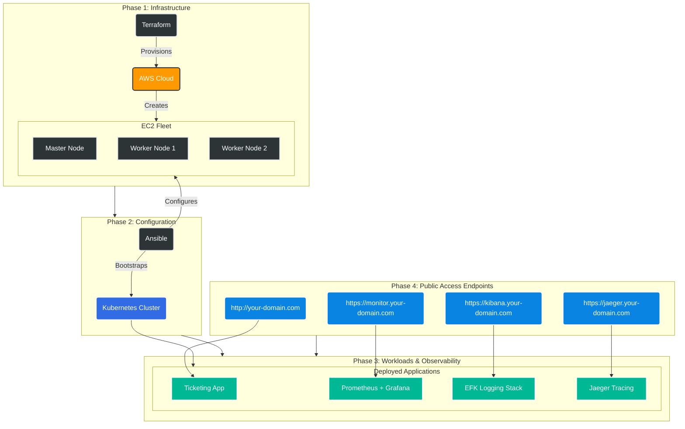

# 🚀 Automated Kubernetes DevOps Pipeline on AWS (My Complete Infra)

      

## 📋 Table of Contents

- [📖 Project Overview](#-project-overview)
- [🏗️ Architecture](#️-architecture)
- [📂 Repository Structure](#-repository-structure)
- [✅ Prerequisites & Setup Guide](#-prerequisites--setup-guide)
- [🚀 Getting Started](#-getting-started)
- [🔗 Access Points & Domain URLs](#-access-points--domain-urls)
- [🛠️ Key Technical Implementations & Fixes](#️-key-technical-implementations--fixes)
- [📊 Verification](#-verification)
- [🧹 Cleanup](#-cleanup)
- [🆘 Troubleshooting](#-troubleshooting)

## 📖 Project Overview

This folder contains the infrastructure-as-code (IaC) setup for deploying a complete Kubernetes-based ticketing system infrastructure on AWS, including cluster setup, application deployment, and observability components.

The `deploy_all.sh` script orchestrates the end-to-end deployment process, automating the following stages:

1. **Terraform Deployment**: Provisions AWS infrastructure (e.g., EC2 instances for Kubernetes nodes).
2. **Ansible Cluster Setup**: Configures the Kubernetes cluster using Ansible playbooks.
3. **Kubernetes Resources Deployment**: Deploys application and database resources to the cluster.
4. **Observability Setup**: Installs logging, monitoring, and tracing components.

To ensure consistency and eliminate "it works on my machine" issues, this project runs entirely inside a custom **Dockerized Control Node**.

---

## 🏗️ Architecture

The pipeline automates the following architecture:



* **Infrastructure:** AWS EC2 Instances (Master & Worker Nodes) via Terraform.
* **Configuration:** Ansible Playbooks for Kubeadm setup, CNI (Calico/Flannel), and joining nodes.
* **Application:** Python/Flask Ticketing App deployed via Kubernetes Manifests (Nginx Ingress).
* **Observability Stack:**
    * **Monitoring:** Prometheus + Grafana.
    * **Logging:** EFK Stack (Elasticsearch, Fluentbit, Kibana).
    * **Tracing:** Elasticsearch + Jaeger.

---

## 📂 Repository Structure

```text
├── .env                    # Environment variables (TUNNEL_TOKEN, FLASK_SECRET_KEY)
├── deploy_all.sh           # Master orchestration script
├── terraform-k8s-project/  # Terraform scripts for AWS Infrastructure
├── cluster_setup/          # Ansible playbooks for K8s Cluster bootstrapping
├── application_deployment/ # Deployment manifests for the Ticketing App
└── monitoring/             # Prometheus, Grafana, EFK, Jaeger setups
```

---

## ✅ Prerequisites & Setup Guide

Before running the pipeline, follow these setup steps on your host machine.

### 0. Install Docker and Docker Compose

This project requires Docker to run the control node container. Install Docker Desktop (for Windows/Mac) or Docker Engine (for Linux) from the official [Docker website](https://docs.docker.com/get-docker/).

Verify installation:
```bash
docker --version
docker-compose --version
```

### 1. AWS Configuration (`aws configure`)

You need to connect your environment to your AWS account.

1. Open your terminal (or the container terminal).
2. Run the configuration command:
```bash
aws configure
```

3. Enter your details when prompted:
* **AWS Access Key ID:** `Paste Your Key ID`
* **AWS Secret Access Key:** `Paste Your Secret Key`
* **Default region name:** `us-east-1` (or your preferred region like `ap-south-1`)
* **Default output format:** `json`

### 2. Environment Variables

Create a `.env` file in the `my-complete-infra` directory with the following variables:

- **TUNNEL_TOKEN**: Required for Cloudflare tunnel setup.
- **FLASK_SECRET_KEY**: Secret key for the Flask application.

Example `.env` file:
```
TUNNEL_TOKEN=your_cloudflare_tunnel_token_here
FLASK_SECRET_KEY=your_flask_secret_key_here
```

### 3. SSH Key Pair Setup (GitHub & EC2)

#### **Part A: Create GitHub Access Key (To clone/push code)**

If you haven't set up SSH for GitHub yet:

1. Generate a key pair: `ssh-keygen -t ed25519 -C "your_email@example.com"`
2. Start the agent: `eval "$(ssh-agent -s)"` and add the key: `ssh-add ~/.ssh/id_ed25519`
3. Copy the public key: `cat ~/.ssh/id_ed25519.pub`
4. Go to **GitHub Settings** -> **SSH and GPG Keys** -> **New SSH Key**.
5. Paste the key and save.

#### **Part B: Create EC2 Access Key (For Ansible)**

This key is required for Ansible to log in to your AWS servers.

1. Log in to the **AWS Console** -> **EC2** -> **Key Pairs**.
2. Click **Create key pair**.
3. Name it: `flask-key`
4. Select Format: `.pem` (for OpenSSH).
5. Download the file and **move it** to the `cluster_setup/`, `application_deployment/`, and `monitoring/` folders in this project:
```bash
chmod 600 ./cluster_setup/flask-key.pem
chmod 600 ./application_deployment/flask-key.pem
chmod 600 ./monitoring/flask-key.pem
```

---

## 🚀 Getting Started

### Phase 1: Build the Control Node

We do not install tools locally. We build a standardized Ubuntu container that has all specific versions of Terraform and Ansible pre-installed.

1. **Clone the Repository:**
```bash
git clone https://github.com/your-repo/itsm-ticket-management.git
cd my-complete-infra
```

2. **Launch the Environment:**
This builds the image, creates the `ubuntu` user, and applies global fixes for WSL/Docker compatibility.
```bash
docker-compose -f ../ubuntu/docker-compose-ubuntu.yml up -d --build
```

3. **Enter the Control Node:**
```bash
docker exec -it k8s-deployer bash
```

### Phase 2: Deploy the Pipeline

Once inside the container (`ubuntu@container-id`), run the deployment:

1. **Initialize Permissions (First Run):**
Ensure the `ubuntu` user owns the workspace to prevent Terraform lock errors.
```bash
sudo chown -R ubuntu:ubuntu ~/my-complete-infra
chmod 0755 ~/my-complete-infra/deploy_all.sh
```

2. **Run the Master Script:**
This script runs Terraform apply, updates the Ansible inventory dynamically, and triggers the playbooks.
```bash
cd ~/my-complete-infra
./deploy_all.sh
```

---

## 🔗 Access Points & Domain URLs

This project uses **Nginx Ingress** to route traffic. We do not use AWS LoadBalancers; traffic is routed directly via the Public IP of the worker nodes mapped to the following domains.

| Service | Protocol | Access URL (Domain) | Credentials (Default) |
| --- | --- | --- | --- |
| **Ticketing App** | HTTP | [your-domain.com](https://your-domain.com/) | N/A |
| **Kibana** | HTTPS | [kibana.your-domain.com](https://kibana.your-domain.com/) | N/A |
| **Grafana** | HTTPS | [monitor.your-domain.com](https://monitor.your-domain.com/) | `admin` / `admin` |
| **Jaeger UI** | HTTPS | [jaeger.your-domain.com](https://jaeger.your-domain.com/) | N/A |

> **DNS Note:** Ensure your DNS provider points these subdomains to the **Public IP** of your Kubernetes Worker Node. You can find this IP by running `terraform output` or checking the AWS Console.
>
> **Alternative Access:** If DNS is not configured, you can access the services directly using the Public IP and default ports:
> - Ticketing App: `http://<PublicIP>:80`
> - Kibana: `https://<PublicIP>:443`
> - Grafana: `https://<PublicIP>:443`
> - Jaeger UI: `https://<PublicIP>:443`

---

## 🛠️ Key Technical Implementations & Fixes

This project includes advanced configurations to solve common DevOps challenges:

### 1. Docker & Ansible Compatibility (The Multiplexing Fix)

* **Problem:** Ansible often fails inside Docker containers on Windows/WSL due to "Control Socket" errors (`Connection refused`).
* **Solution:** We baked a global configuration into `/etc/ansible/ansible.cfg` to disable SSH Multiplexing:
```ini
[ssh_connection]
ssh_args = -o ControlMaster=no -o ControlPath=none
```

### 2. Automated Kibana Configuration

* **Problem:** Kibana deployments usually require manual GUI clicks to set up Index Patterns.
* **Solution:** The pipeline includes a "Wait & Configure" task. It polls the Kibana API until it returns `200 OK`, then uses `curl` to automatically create the `logstash-*` index pattern and set it as default.

### 3. Terraform State Locking Fix

* **Problem:** Running Terraform as root locks state files, making them unreadable by other users.
* **Solution:** The Dockerfile creates a non-root `ubuntu` user (UID 1000) and the pipeline enforces correct ownership (`chown`) before execution.

---

## 📊 Verification

After the script completes (`🎉 DEPLOYMENT COMPLETE!`), verify the setup:

1. **Check Nodes:**
```bash
kubectl get nodes
```

2. **Check Ingress Rules:**
```bash
kubectl get ingress -A
```

3. **Check Logs:**
Visit the **Kibana** URL to see centralized logs from all pods flowing through Fluentbit and Elasticsearch.
4. **Check Traces:**
Visit **Jaeger** to visualize request tracing across the application microservices.

---

## 🧹 Cleanup

To destroy the entire infrastructure and avoid ongoing AWS charges, follow these steps:

### 1. Destroy Kubernetes Resources

Inside the container, run:
```bash
cd ~/my-complete-infra
./destroy_all.sh  # If available, or manually delete resources
```

### 2. Destroy Terraform Infrastructure

```bash
cd ~/my-complete-infra/terraform-k8s-project
terraform destroy -auto-approve
```

### 3. Stop and Remove Docker Container

On your host machine:
```bash
docker-compose -f ../ubuntu/docker-compose-ubuntu.yml down
```

> **Warning:** This will permanently delete all resources, including EC2 instances, Kubernetes cluster, and data. Ensure you have backups if needed.

---

## 🆘 Troubleshooting

| Error | Fix |
| --- | --- |
| **Permission Denied (Terraform)** | Run `sudo chown -R ubuntu:ubuntu ~/my-complete-infra` inside the container. |
| **SSH Connection Refused** | Ensure `flask-key.pem` is in `cluster_setup/`, `application_deployment/`, and `monitoring/` and permissions are `600`. |
| **Kibana Index Failed** | The script retries automatically. If it fails, check if the Kibana pod is `Running`. |
| **Missing TUNNEL_TOKEN or FLASK_SECRET_KEY** | Ensure the `.env` file is present and variables are set; the script will exit if absent. |

---

**Author:** Anil Jaiswar
**License:** MIT
