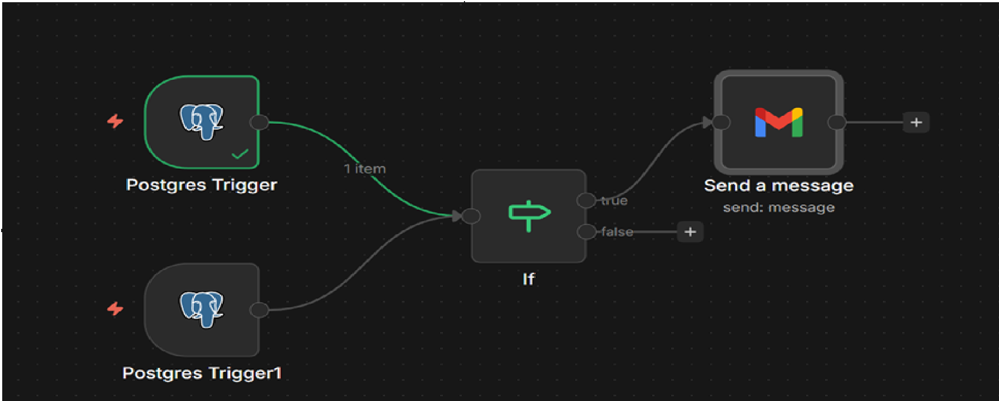

# ITSM Ticket Management Tool

A web-based IT Service Management (ITSM) application designed to streamline the creation, tracking, and resolution of IT support tickets. Built with Python, Flask, PostgreSQL, and HTML, this tool simulates real-world helpdesk workflows, making it ideal for managing IT incidents and user support requests.

             

## Features
- **Ticket Management**: Create, edit, search, and track tickets with attributes like title, description, priority (High, Medium, Low), and status (Open, In Progress, Resolved).
- **User Authentication**: Secure login system with role-based access control (admin and readonly roles) using hashed passwords.
- **Admin Dashboard**: Admins can manage users (add/remove) and update ticket details, while readonly users can view tickets.
- **Ticket Search**: Search tickets by title for quick access to relevant issues.
- **Data Visualization**: Displays ticket priority and status distributions (via `/get_chart_data` endpoint, compatible with Chart.js).
- **Workflow Automation (n8n)**: Integrates n8n for event-driven "ChatOps" and incident response. Includes real-time critical incident response that listens to the PostgreSQL database (`tickets` table), filters for high/critical priority tickets, and sends email alerts to the engineering team. The n8n container is secured with read-only filesystem and no-new-privileges.



- **Responsive UI**: Built with HTML and Jinja2 templates for a user-friendly interface, suitable for support staff.

## Technologies
- **Programming Languages**: Python, HTML, JavaScript, SQL
- **Framework**: Flask (Python web framework)
- **Database**: PostgreSQL (relational database)
- **Security**: Werkzeug for password hashing and secure authentication
- **Templating**: Jinja2 for dynamic HTML rendering
- **Frontend**: Bootstrap (implied for responsive design)
- **Workflow Automation**: n8n (event-driven automation and incident response)
- **Version Control**: Git, hosted on GitHub

## Prerequisites
- Python 3.6 or higher
- pip (Python package manager)
- Git
- Docker

## PostgreSQL Database Setup

---

## 1. Download and Install PostgreSQL

Download PostgreSQL for Windows from the official site:
[https://www.postgresql.org/download/windows/](https://www.postgresql.org/download/windows/)

Complete the installation and note the **version** and **installation path**.

---

## 2. Configure PostgreSQL Environment Variables (Windows)

### Step 1: Open Environment Variables

1. Press **Windows + R**
2. Type `sysdm.cpl` and press **Enter**
3. Open the **Advanced** tab
4. Click **Environment Variables**

---

### Step 2: Add PostgreSQL to PATH

1. Under **System variables**, select **Path**
2. Click **Edit**
3. Click **New**
4. Add the following path:

   ```
   C:\Program Files\PostgreSQL\18\bin
   ```
5. Click **OK** → **OK** → **OK** to save

---

### Step 3: Restart Terminal

Close all Command Prompt or PowerShell windows and open a new one.

---

### Step 4: Verify Installation

Open **Command Prompt** and run:

```cmd
psql --version
```

If PostgreSQL is configured correctly, the version number will be displayed.

---

## 3. Create Database and User (Using pgAdmin)

### Open pgAdmin

Launch **pgAdmin 4** and log in.

---

### Create a User

1. Right-click **Login/Group Roles** → **Create** → **Login/Group Role**
2. Set the name to:

   ```
   app
   ```
3. Go to the **Definition** tab:

   * Set a password (e.g., `admin123`)
   * Save this password for later use
4. Go to the **Privileges** tab:

   * Enable **Can login?**
   * Enable **Superuser?** (recommended for development)
5. Click **Save**

---

### Create a Database

1. Right-click **Databases** → **Create** → **Database**
2. Database name:

   ```
   app
   ```
3. Owner: select **app**
4. Click **Save**

---

## 4. Import `backup.sql`

1. Open **Command Prompt** or **PowerShell**
2. Navigate to the folder containing `backup.sql`:

   ```cmd
   cd C:\Users\jaisw\Downloads\TicketingSystem\k8s\application_deployment
   ```
3. Run the import command:

   ```cmd
   psql -U postgres -d app -f backup.sql
   ```

---

## 5. Allow Docker to Connect to PostgreSQL

### Step 1: Locate PostgreSQL Data Directory

Navigate to:

```
C:\Program Files\PostgreSQL\16\data
```

---

### Step 2: Update `postgresql.conf`

1. Open `postgresql.conf` in **Notepad (Run as Administrator)**
2. Find:

   ```
   #listen_addresses = 'localhost'
   ```
3. Change it to:

   ```
   listen_addresses = '*'
   ```
4. Save and close the file

---

### Step 3: Update `pg_hba.conf`

1. Open `pg_hba.conf` in **Notepad (Run as Administrator)**
2. Add the following line at the **end of the file**:

   ```
   host    all    all    0.0.0.0/0    scram-sha-256
   ```
3. Save and close the file

---

### Step 4: Restart PostgreSQL Service

1. Press **Windows + R**, type `services.msc`, and press **Enter**
2. Find **postgresql-x64-16**
3. Right-click and select **Restart**

---

## Setup Instructions
1. **Clone the Repository**:
   ```bash
   git clone https://github.com/jaiswaranil8387/itsm-ticket-management.git
   cd src
   ```
2. **Install Dependencies**:
   ```bash
   pip install -r requirements.txt
   ```
3. **Initialize the Database**:
   - The application automatically creates a `tickets.db` SQLite database with sample tickets and a default admin user (username: `admin`, password: `admin123`) on first run.

4. **Create Environment File**:
   - Create a `.env` file in the root directory of the project with the following variables:
     ```
     FLASK_SECRET_KEY=your_secret_key_here
     DB_PASSWORD=your_db_password
     TUNNEL_TOKEN=your_tunnel_token_here_if_using_cloudflare
     
     ```
     Replace the placeholder values with your actual database credentials and a secure secret key.
     
5. **Run the Application**:
   You can run the application in two ways:

   **Option 1: Direct Python Execution**
   ```bash
   python app.py
   ```

   **Option 2: Using Docker Compose**
   ```bash
   docker-compose -f docker-compose-postgres.yaml up --build
   ```
6. **Access the Application**:
   1. For direct python app
      http://localhost:5000
   2. For docker
      http://localhost:5000
      https://uat.aniljaiswar.pp.ua/
   - Log in with the default admin credentials or create new users via the admin dashboard.

7. **Access n8n Dashboard** (for Workflow Automation):
   - The n8n service is included in the `docker-compose-postgres.yaml` file.
   - URL: [http://localhost:5678](http://localhost:5678)
   - *Note: On first run, you will be prompted to set up an owner account.*
   - **Configure Credentials**:
     - **Postgres**: Host: `db` (Service name), Port: `5432`, User/Pass: (Same as `.env`).
     - **Email**: Supports SMTP or Gmail OAuth2 (ensure Redirect URLs are configured in Google Cloud Console).
   - **Import Workflow**:
     - Import the JSON workflow file located in `workflows/Critical_Incident_Workflow.json` (if available) or create the flow manually using the Postgres Trigger node.

## Usage
- **Login**: Use the default admin credentials (username: `admin`, password: `admin123`) or create a new user.
- **Create Tickets**: Admins can add tickets via the "Create Ticket" tab, specifying title, description, and priority.
- **Manage Tickets**: Update ticket status (Open, In Progress, Resolved) or edit ticket details from the ticket list.
- **Search Tickets**: Use the search bar to find tickets by title.
- **Manage Users**: Admins can add or remove users via the "Manage Users" tab.
- **View Analytics**: Check ticket priority and status distributions (requires Chart.js integration for visualization).

## Contributing
Contributions are welcome! To contribute:
1. Fork the repository.
2. Create a new branch (`git checkout -b feature/your-feature`).
3. Make your changes and commit (`git commit -m "Add your feature"`).
4. Push to your branch (`git push origin feature/your-feature`).
5. Open a pull request on GitHub.

Please report bugs or suggest features via the [Issues](https://github.com/jaiswaranil8387/itsm-ticket-management/issues) page.

## License
This project is licensed under the MIT License.

## Contact
For questions or feedback, reach out via [GitHub Issues](https://github.com/jaiswaranil8387/itsm-ticket-management/issues).